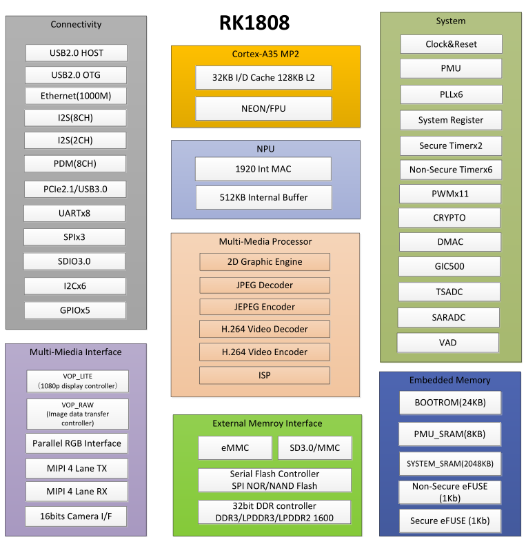

# [RK1808](https://github.com/sochub/RK1808) 

#### 厂商：[rockchips](https://github.com/sochub/rockchips)
#### 架构：[cortex A35](https://github.com/sochub/CA35)
### [RK1808简介](https://github.com/sochub/RK1808/wiki)

瑞芯微RK1808 AIoT芯片，采用22nm FD-SOI工艺制造，CPU上采用双核Cortex-A35架构，最高主频1.6GHz，内置2MB系统级SRAM，可实现always-on设备无DDR运行，NPU部分的峰值算力高达3.0TOPs，支持INT8/INT16/FP16混合运算，最大程度兼顾性能、功耗、运算精度，并支持TensorFlow/MXNet/PyTorch/Caffe等一系列框架的网络模型转换，兼容性强。

RK1808还有丰富的外设接口，便于应用扩展。视频支持MIPI/CIF/BT1120输入，支持MIPI/RGB显示输出；具有PWM/I2C/SPI/UART等一系列传感器输入输出接口；具有USB3.0/USB2.0/PCIE等高速设备接口，支持千兆以太网及外置WiFi/BT模块；音频支持麦克风阵列输入，同时支持音频输出。

操作系统支持Linux，AI应用开发SDK支持C/C++及Python

* 主要特点：3.0TPOS NPU
* 功能特点：USB3.0、PCIE等
* 主要短板：双A35核心

### [收录资料](https://github.com/sochub/RK1808)

* [文档](docs/)
* [资源](src/)

 ### 官方资源

 [linux系统](https://github.com/rockchip-linux/kernel.git)

### [选型建议](https://github.com/sochub)

[RK1808](https://github.com/sochub/RK1808) 集成NPU单元，是开源处理器中少有的，具有极高的性价比，同时各种外设端口丰富，相较前辈[RK3399PRO](https://github.com/sochub/RK3399PRO) 更具有应用想象空间。

###  [SoC资源平台](http://www.qitas.cn)